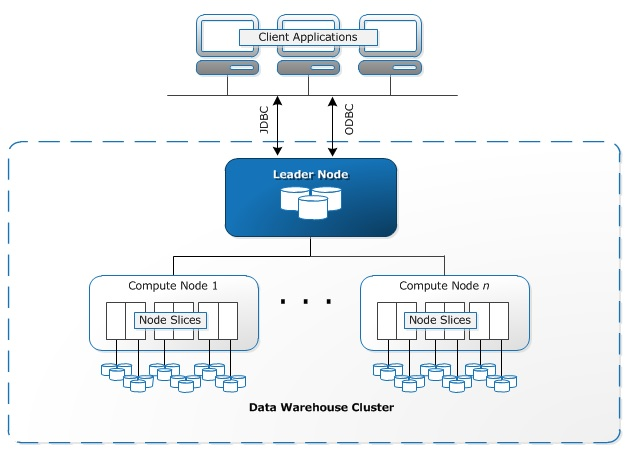
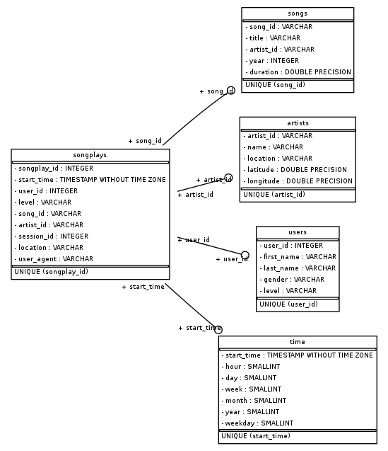

## Project Name
Creation, Data Modeling and Data loading of Amazon Redshift datawarehouse (using Star schema design) for music streaming startup **Sparkify** to perform Song Play Analysis.

## Project Description & Purpose
A startup called Sparkify wants to analyze the data they've been collecting on songs and user activity on their new music streaming app. The analytics team is particularly interested in understanding what songs users are listening to. Currently, they don't have an easy way to query their data, which resides in a directory of JSON logs on user activity on the app, as well as a directory with JSON metadata on the songs in their app.

The purpose of this project is to create a Datawarehouse in Amazon Redshift with Dimension and Fact tables designed to optimize queries on song play analysis, which will help analytics team in understanding what songs users are listening to. To achieve this, the ETL pipeline needs to be built to load the Songs and Song play log data from AWS S3 layer into a Staging layer in Redshift and then subsequently load the data in to the Redshift datawarehouse which will be used by the analytics team for further analysis. 


## Cloud Architecture

In this project, the source JSON datasets, Intermediate Staging layer and the final Datawarehouse - All these 3 entities exists in cloud.
This project's architecture is implemented in Amazon Web Services (AWS) Cloud platform.

The various AWS components involved or required in this are as follows:
* **Amazon S3**
  * Amazon Simple Storage Service (Amazon S3) is an object storage service that offers industry-leading scalability, data availability, security, and performance.
  * Amazon S3 has a simple web services interface that you can use to store and retrieve any amount of data, at any time, from anywhere on the web. It gives any developer access to the same highly scalable, reliable, fast, inexpensive data storage infrastructure that Amazon uses to run its own global network of web sites. The service aims to maximize benefits of scale and to pass those benefits on to developers.
  * To upload the data to Amazon S3, we must first create an S3 bucket in one of the AWS Regions. We can then upload any number of objects to the bucket.
  * Amazon S3 creates buckets in a Region you specify. To optimize latency, minimize costs, or address regulatory requirements, choose any AWS Region that is geographically close to you.
  * An Amazon S3 bucket name is globally unique, and the namespace is shared by all AWS accounts. This means that after a bucket is created, the name of that bucket cannot be used by another AWS account in any AWS Region until the bucket is deleted. 
  * In this project, the Songs and Log datasets resides in a public S3 bucket "**udacity-dend**" whosee path is as follows: <https://s3.console.aws.amazon.com/s3/buckets/udacity-dend/?region=ca-central-1&tab=overview>.
  
  
* **Redshift**
  * An Amazon Redshift data warehouse is a collection of computing resources called nodes, which are organized into a group called a cluster. 
  * Each cluster runs an Amazon Redshift engine and contains one or more databases.
  * An Amazon Redshift cluster consists of nodes. Each cluster has a leader node and one or more compute nodes. The leader node receives queries from client applications, parses the queries, and develops query execution plans. The leader node then coordinates the parallel execution of these plans with the compute nodes and aggregates the intermediate results from these nodes. It then finally returns the results back to the client applications.
  * The node type determines the CPU, RAM, storage capacity, and storage drive type for each node. The dense storage (DS) node types are storage optimized. The dense compute (DC) node types are compute optimized.
  * Node types are available in different sizes. DS2 nodes are available in xlarge and 8xlarge sizes. DC2 nodes are available in large and 8xlarge sizes. Node size and the number of nodes determine the total storage for a cluster.

  * Compute nodes execute the query execution plans and transmit data among themselves to serve these queries. The intermediate results are sent to the leader node for aggregation before being sent back to the client applications. For more information about leader nodes and compute nodes, see Data Warehouse System Architecture (<https://docs.aws.amazon.com/redshift/latest/dg/c_high_level_system_architecture.html>) in the Amazon Redshift Database Developer Guide.
  
  Mentioned below is the diagram for Redshift architecture.


* **Node Type = dc2.large**
  * Determines the compute and memory capacity of the Cluster
      
* **Nodes = 4**
  * Number of Nodes for the cluster
      
* **Zone = us-west-2c**
  * The EC2 Availability Zone that the cluster was created in
      
* **Port = 5439**
  * Port number on which the database accepts connections


* **IAM**
  * AWS Identity and Access Management (IAM) enables you to manage access to AWS services and resources securely. 
  * Using IAM, you can create and manage AWS users and groups, and use permissions to allow and deny their access to AWS resources. 
  * In this project, a new IAM role is created and the Policy to read S3 buckets is attached. Later this role is assigned to Redshift clusters in order to authorize the data extraction from S3 buckets.


## AWS config file (*Important !*)
The AWS cloud configuration such as Host/Endpoint name, DB Name, Port, Username, Password, IAM Role, S3 Bucket locations are all set in a config file named as "dwh.cfg" where "dwh" is the database name used in this project. For confidential reasons, this file is not added in Github as the file is setup in gitignore. While cloning the project, please make sure to add create the < database-name >.cfg file and assign the values for the config variables.

The config structure and variables are as follows:
```
[CLUSTER]  
HOST=  
DB_NAME=  
DB_USER=  
DB_PASSWORD=  
DB_PORT=5439  
REGION=us-west-2  
  
[IAM_ROLE]  
ARN=  
  
[S3]  
LOG_DATA='s3://udacity-dend/log_data'  
LOG_JSONPATH='s3://udacity-dend/log_json_path.json'  
SONG_DATA='s3://udacity-dend/song_data'  
```


## Source(s)

In this project, the data is extracted from 2 set of files which are of JSON file format located in a public S3 bucket "udacity-dend".
The S3 links for the datasets are as follows:

* Song data: 
  * *s3://udacity-dend/song_data*  (<https://s3.console.aws.amazon.com/s3/buckets/udacity-dend/log-data/?region=ca-central-1>)
* Log data: 
  * *s3://udacity-dend/log_data* (<https://s3.console.aws.amazon.com/s3/buckets/udacity-dend/song-data/?region=ca-central-1&tab=overview>)
* Log data json path: 
  * *s3://udacity-dend/log_json_path.json* (<https://s3.console.aws.amazon.com/s3/object/udacity-dend/log_json_path.json?region=ca-central-1&tab=overview>)

#### Song Dataset
The first dataset is a subset of real data from the Million Song Dataset. Each file is in JSON format and contains metadata about a song and the artist of that song. The files are partitioned by the first three letters of each song's track ID. For example, here are filepaths to two files in this dataset.

`song_data/A/B/C/TRABCEI128F424C983.json`
`song_data/A/A/B/TRAABJL12903CDCF1A.json`

And below is an example of what a single song file, TRAABJL12903CDCF1A.json, looks like.

`{"num_songs": 1, "artist_id": "ARJIE2Y1187B994AB7", "artist_latitude": null, "artist_longitude": null, "artist_location": "", "artist_name": "Line Renaud", "song_id": "SOUPIRU12A6D4FA1E1", "title": "Der Kleine Dompfaff", "duration": 152.92036, "year": 0}`
  

#### Log Dataset
The second dataset consists of log files in JSON format which has the Song play activity logs from a music streaming app based on specified configurations.

The log files are partitioned by year and month. For example, here are filepaths to two files in this dataset.

`log_data/2018/11/2018-11-12-events.json`
`log_data/2018/11/2018-11-13-events.json`

And below is an example of what the data in a log file, 2018-11-12-events.json, looks like.


## Staging
The data extracted from Source JSON files are loaded into a set of Staging tables in Redshift database, named as `dwh`.
This includes the following tables.

#### Staging Tables
1. **staging_events** - records in log data associated with song plays i.e. records with page NextSong
    *     artist, auth, firstName, gender, itemInSession, lastName, length, level, location, method, page, registration, sessionId, song, status, ts, userAgent, userId
    
2. **staging_songs** - 
    *     num_songs, artist_id, artist_latitude, artist_longitude, artist_location, artist_name, song_id, title, duration, year 

## Target(s)
The data from Staging tables are loaded into a new Redshift datawarehouse named as `dwh` which is modeled based on star schema design. This includes the following tables.

#### Fact Table
1. **songplays** - records in log data associated with song plays i.e. records with page NextSong
    * songplay_id, start_time, user_id, level, song_id, artist_id, session_id, location, user_agent
    
#### Dimension Tables
2. **users** - users in the app
    * user_id, first_name, last_name, gender, level
3. **songs** - songs in music database
    * song_id, title, artist_id, year, duration
4. **artists** - artists in music database
    * artist_id, name, location, lattitude, longitude
5. **time** - timestamps of records in songplays broken down into specific units
    * start_time, hour, day, week, month, year, weekday

### Database Schema Diagram
Following is the Schema Diagram for **sparkify** database.


## ETL Process

In computing, extract, transform, load (ETL) is the general procedure of copying data from one or more sources into a destination system which represents the data differently from the source(s). 

1. Data extraction (**Extract**) involves extracting data from homogeneous or heterogeneous sources; 
2. Data transformation (**Transform**) processes data by data cleansing and transforming them into a proper storage format/structure for the purposes of querying and analysis; 
3. Finally, Data loading (**Load**) describes the insertion of data into the final target database such as an operational data store, a data mart, or a data warehouse.

#### ETL - Extract Step
Data is extracted from 2 set of files located in AWS S3 buckets which are of JSON file format. 
* songs data
* log data

Data is extracted using COPY command to facilitate faster retrieval and loaded into Staging tables.
S3 Bucket name, IAM Role ARN and AWS Host region are passed as parameters.

The log files has the column names in mixed case. But the tables in AWS are internally converted as lower case. Due to this reason, loading JSON log files in auto mode will not automatically detect the correct JSON paths.
So for loading JSON log files, we need to pass the JSON file path explicityly which is stored in S3 bucket location (<https://s3.console.aws.amazon.com/s3/object/udacity-dend/log_json_path.json?region=ca-central-1&tab=overview>)

```
copy staging_songs from <S3 Bucket Name for Log dataset>
credentials 'aws_iam_role=<IAM Riel ARN>'
json <JSON file path>
region '<Cluster Region>';
```
However, song files are having the columns in lowercase and so it is possible to copy the song files without an explicit path file. So for loading song files, we can use json auto mode.

```
copy staging_songs from <S3 Bucket Name for Songs dataset>
credentials 'aws_iam_role=<IAM Riel ARN>'
json 'auto'
region '<Cluster Region>';
```


#### ETL - Transform Step
The timestamp for each song play (Start time) is coming from source as milliseconds format. This needs to be transformed into proper datetime format before loading into Time dimension. Also, the following time related fields are derived from the timestamp and stored into Time dimension.

* start_time (Timestamp after converting from milliseconds to datetime format)
* hour
* day
* week
* month 
* year
* weekday

#### ETL - Load Step
In the Load step, the extracted and transformed data is loaded into the Dimension and Fact tables. While loading Dimensions, duplicates are eliminated at database level.

##### Users Dimension Load
Distinct users are extracted from staging_events table and loaded in Users dimension.
There will be duplicate records for users from source due to the nature where a "free" user would have changed to "paid" user later.
So there can be atleast 2 records for same user id with "level" value as "free" & "paid".
To handle that scenario, the values are grouped based on userId, firstName, lastName and gender and a maximum value of "level" is taken.

Since the Users dimension is relatively small, it is distributed using Distribution style "all". This wil broadcast the table into all clustes which allows faster joining with fact table.

##### Songs Dimension Load
Distinct songs are extracted from staging_songs table. This table is already unique based on Song ID.

Since the Songs dimension is relatively large, it is distributed using Distribution Key "Song_id".

##### Artists Dimension Load
Distinct Artists are extracted from staging_songs table. 
In some sceanrios, we can find duplicate records for Artist ID which has different Artist names.
To handle that, the Artist data is partitioned by Artist ID and the records with latest year is pciked up.

This dimension table is distributed using Distribution style even.

##### Time Dimension Load
Distinct time values (under the column "ts") are extracted from staging_events table.
The Time values in staging table is text field whose value is in milliseconds.
The Epoch time value is converted into Timestamp and then various attributes such as hour, day, month, week, years, weekday are extracted.

This dimension table is distributed using Distribution style even.


##### Songplays Fact Load
Data from staging_events are loaded into the facts by joining with other dimension tables to get the Dimension keys.

User_id is used to join Users dimension and Start_time is used to join Time dimension.

The events/log data does not specify an ID for either the song or the artist. So in order to relate the corresponding song ID and artist ID for each songplay, a combination of song title, artist name, and song duration time are used. 

The query used for Songs/Artists dimension lookup to assign song ID and artist ID is as follows:

##### Dimension Lookup Query:
```
select s.song_id, a.artist_id 
    from songs s  
    inner join artists a  
    on s.artist_id = a.artist_id
    where s.title = %s 
    and a.name = %s
    and s.duration = %s
```

Since the Songplays Fact table is relatively large, it is distributed using Distribution Key "Song_id" and sorted using sort key "start_time".

##### Target Table count

Table | Remarks |record count
------|--------- |-----------
songs | Total Count | 14896
artists | Total Count | 9553
users | Total Count | 97
time | Total Count | 8023
songplays | Total Count | 6820


## Project execution steps
Run the following scripts in the mentioned order.
1. `create_tables.py`

2. `etl.py`


*Since multiple connections to the same database (in this case, sparkifydb) is not possible, please make sure to restart the kernel (or kill the exising active connection) before every new run*

## Environment and Skills
- Python, Ipython
- AWS - S3, IAM, ec2, Redshift

## References:
http://archive.oreilly.com/oreillyschool/courses/dba3/
https://docs.aws.amazon.com/redshift/latest/dg/r_CREATE_TABLE_NEW.html
https://www.geeksforgeeks.org/creating-a-pandas-dataframe-using-list-of-tuples/
https://www.fernandomc.com/posts/redshift-epochs-and-timestamps/